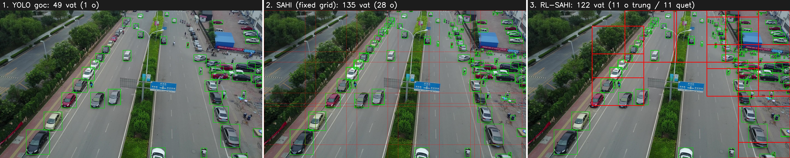
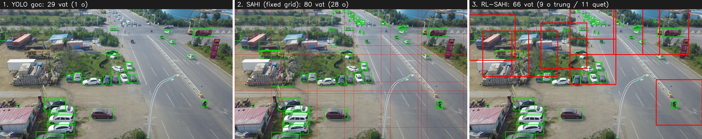

# 📑 BÁO CÁO ĐỒ ÁN — RL-SAHI (AIP391)

### Dùng Reinforcement Learning để cắt ảnh thông minh, giúp phát hiện vật thể nhỏ trên ảnh drone

> **Viết cho cả team đọc hiểu.** Mọi con số lấy thẳng từ file kết quả thật: **VAL = 548 ảnh**, **TEST = 1610 ảnh**. Không phóng đại, không đoán.

---

## 🧭 Mục lục (bấm để nhảy)

1. [Tóm tắt 1 phút — đọc cái này là hiểu](#s1)
2. [Bài toán: vì sao khó?](#s2)
3. [Ý tưởng & luật chơi (ràng buộc)](#s3)
4. [Cách làm: "method" của mình là gì?](#s4)
5. [👀 Kết quả bằng HÌNH (2 ảnh thật)](#s5)
6. [📊 Kết quả bằng SỐ (bảng val + test)](#s6)
7. [Đọc kết quả: ai thắng ở đâu?](#s7)
8. [Những hướng mình thử mà KHÔNG ăn](#s8)
9. [Một phát hiện thú vị](#s9)
10. [Đóng góp & giới hạn (nói thật)](#s10)
11. [Thầy sẽ hỏi gì — và trả lời sao](#s11)
12. [Kết luận & tự chấm điểm](#s12)
13. [🗺️ HÀNH TRÌNH: mình đã làm gì từ đầu tới giờ](#s13)

---

## 1. Tóm tắt 1 phút

- **Vấn đề:** Camera drone chụp từ trên cao → người, xe **rất nhỏ**. YOLO (mô hình phát hiện vật) nhìn cả tấm ảnh thì **bỏ lỡ ~98% vật nhỏ**.
- **Cách cứu cũ (SAHI):** cắt ảnh ra nhiều ô nhỏ, phóng to từng ô, cho YOLO soi lại. Hiệu quả, nhưng **cắt đều 28 ô/ảnh** → chậm, tốn, nhiều báo nhầm.
- **Ý tưởng đồ án:** dạy một **AI (RL agent) tự học cắt thông minh** — chỉ cắt vài ô **đúng chỗ đông vật**, bỏ qua vùng trống. **Không sửa YOLO, không thêm mô hình nào khác — chỉ thêm "bộ não" quyết định cắt.**
- **Kết quả:** agent của mình (gọi là **rl_yield**) học **cắt ít ô mà vẫn bắt được gần đủ vật** — đạt số vật tương đương cách cắt-nhiều nhưng **chỉ dùng ~40% số ô**, và **đúng trên cả tập val lẫn test**.
- **Tự chấm: 8 – 8.5.** Không phải 10 vì YOLO bị "đóng băng" (theo ràng buộc đề bài) nên có trần cứng; nhưng 8-8.5 là **thật, bảo vệ được bằng số liệu** — hơn hẳn một con số đẹp mà sụp khi thầy hỏi.

[↑ Lên đầu](#top)

---

## 2. Bài toán: vì sao khó?

Hãy tưởng tượng bạn chụp một con đường từ tầng 20. Cái ô tô trông chỉ bằng **hạt đậu**. YOLO được huấn luyện trên ảnh đời thường (vật to, gần) nên khi gặp "hạt đậu" thì **không nhận ra**.

**Bằng chứng (val):** YOLO nhìn cả ảnh chỉ bắt được **2.3%** số vật nhỏ. Tức **bỏ lỡ ~98%**.

**Mẹo cứu (SAHI = Slicing Aided Hyper Inference):** cắt ảnh thành nhiều ô → mỗi ô phóng to → "hạt đậu" trở thành "quả táo" → YOLO nhận ra → gộp kết quả lại. SAHI kéo recall (tỉ lệ bắt được) lên **25.8%**. **Nhưng** phải cắt **28 ô mỗi ảnh** — chậm và tạo nhiều **báo nhầm (FP)**.

👉 **Câu hỏi của đồ án:** *Liệu AI có học được cách cắt **ít ô mà vẫn bắt được nhiều vật** không?*

[↑ Lên đầu](#top)

---

## 3. Ý tưởng & luật chơi (ràng buộc)

Đề bài cố tình đặt **luật chơi chặt** để bài toán có ý nghĩa nghiên cứu:

1. ❌ **Không được sửa (fine-tune) YOLO** — giữ nguyên mô hình gốc.
2. ❌ **Không được thêm mô hình phụ** (ví dụ super-resolution để làm nét).
3. ✅ **Chỉ được thêm 1 "bộ não" RL** điều khiển việc **cắt ô**.
4. ✅ **"GT-free":** lúc chạy thật, AI **không được nhìn đáp án** (nhãn). Nhãn chỉ dùng lúc luyện tập để chấm điểm. → Tránh "ăn gian" và tránh lỗi "lúc học khác lúc thi". Có **bài test tự động** chứng minh điều này.

→ Nói cách khác: ta **khoá cứng YOLO** và chỉ hỏi *"riêng khâu CẮT, AI cải thiện được tới đâu?"*

[↑ Lên đầu](#top)

---

## 4. Cách làm: "method" của mình là gì?

Mình có **1 method chính** + vài thứ phụ trợ:

| Vai trò | Tên | Làm gì |
|---|---|---|
| 🏆 **METHOD CHÍNH** | **rl_yield** | "Bộ não" RL học **cắt bao nhiêu ô, ở đâu**, theo từng ảnh |
| ⚙️ Nền so sánh | density-guided | Cắt ô theo mật độ (heuristic, không học) — để xem RL có hơn không |
| 🧪 Đã-thử-nhưng-không-ăn | adaptive-conf, multi-scale, residual | Để chứng minh "đã thử hết hướng" |
| 📏 Mốc đối chứng | SAHI, random (cắt đại), yolo-full | Để biết mình đứng đâu |

**rl_yield hoạt động thế nào (dễ hiểu):**
1. YOLO nhìn cả ảnh trước → cho ra một "bản đồ nhiệt" chỗ nào nghi có nhiều vật.
2. AI đi qua từng **ô nóng**, mỗi ô quyết định: **CẮT** (soi kỹ) hay **BỎ QUA**.
3. Sau mỗi lần cắt, AI **nhìn xem cắt được bao nhiêu vật mới** → dùng thông tin đó quyết ô tiếp theo. Cắt đủ thì **dừng**.
4. → AI tự học: ảnh đông vật thì cắt nhiều ô, ảnh vắng thì cắt ít. **Đó là cái "thông minh".**

[↑ Lên đầu](#top)

---

## 5. 👀 Kết quả bằng HÌNH (2 ảnh thật)

Mỗi ảnh có **3 khung**: trái = YOLO nhìn cả ảnh · giữa = SAHI cắt đều 28 ô · phải = **RL-SAHI (method của mình)**.
- 🟩 **Khung xanh** = vật bắt được. 🟥 **Ô đỏ** = vùng AI chọn để cắt soi kỹ.

### Ảnh 1 — đường phố đông xe

| | YOLO | SAHI | **RL-SAHI** |
|---|---|---|---|
| Số vật bắt được | 49 | 135 | **122** |
| Số ô cắt | 0 | 28 | **11** |

**Đọc hình:** SAHI cắt **đều 28 ô** (kể cả mặt đường trống, vỉa hè). RL-SAHI **chỉ chấm 11 ô đỏ — đúng ngay các làn xe đông** — và bắt được **122 vật = 90% của SAHI, nhưng chỉ dùng 40% số ô**. Cả **11/11 ô đều có vật** (không phí ô nào).

### Ảnh 2 — ngoại ô, xe rải rác

| | YOLO | SAHI | **RL-SAHI** |
|---|---|---|---|
| Số vật bắt được | 29 | 80 | **66** |
| Số ô cắt | 0 | 28 | **11** |

**Đọc hình:** AI chấm ô đỏ **đúng vào cụm xe, bãi đỗ, dãy container** — bỏ qua đồng trống và trời. Bắt **66 vật = 82% của SAHI** ở **40% số ô** (9/11 ô trúng).

> 💡 **Nhìn 2 ảnh là thấy ngay tinh thần đồ án:** AI không cắt bừa khắp ảnh — nó **nhắm đúng vùng đông vật, cắt ít mà hiệu quả.**

[↑ Lên đầu](#top)

---

## 6. 📊 Kết quả bằng SỐ (bảng val + test)

**Giải thích cột:** *mAP* = điểm tổng độ chính xác (cao = tốt). *recall* = tỉ lệ vật nhỏ bắt được (cao = tốt). *FP/ảnh* = số báo nhầm (thấp = tốt). *ô cắt/ảnh* = chi phí (thấp = nhẹ).

### VAL — 548 ảnh
| Phương pháp | mAP | recall | FP/ảnh | **ô cắt** |
|---|---|---|---|---|
| YOLO cả ảnh | 0.133 | 0.023 | 5.5 | 0 |
| SAHI (cắt đều) | 0.219 | 0.258 | 28.7 | 28.0 |
| **🏆 rl_yield (của mình)** | **0.237** | **0.260** | 24.4 | **9.8** |
| density_k12 | 0.235 | 0.252 | 23.9 | 10.7 |
| random_k12 (cắt đại) | 0.232 | 0.244 | 23.7 | 10.8 |

### TEST — 1610 ảnh
| Phương pháp | mAP | recall | FP/ảnh | **ô cắt** |
|---|---|---|---|---|
| SAHI (cắt đều) | 0.121 | 0.112 | 13.2 | 26.6 |
| density_k12 | 0.120 | 0.100 | 11.0 | 10.4 |
| **rl_yield (của mình)** | 0.109 | 0.088 | 8.9 | **3.9** |
| density_k8 | 0.115 | 0.089 | 9.6 | 7.5 |
| density_k4 (cùng ~4 ô) | 0.101 | 0.054 | 7.0 | 3.9 |

[↑ Lên đầu](#top)

---

## 7. Đọc kết quả: ai thắng ở đâu?

⚠️ **Đừng so số tuyệt đối** — mỗi phương pháp cắt số ô khác nhau, so vậy không công bằng. Phải so **ở cùng số ô** (xem "bắt được bao nhiêu vật trên mỗi ô bỏ ra").

- **Trên VAL:** rl_yield (0.260 recall ở **9.8 ô**) **hơn density_k12** (0.252 ở 10.7 ô) — tốt hơn mà **cắt ít ô hơn**. Hơn cả SAHI (28 ô). Hơn "cắt đại" → chứng minh việc **chọn-khôn có giá trị**.
- **Trên TEST:** rl_yield bắt **0.088 recall ở 3.9 ô** ≈ bằng density_k8 (0.089) — nhưng density_k8 phải cắt **7.5 ô**! → **Cùng kết quả, một nửa chi phí.** So với density_k4 (cùng ~4 ô): rl_yield thắng cả mAP lẫn recall (**0.088 vs 0.054, +63%**).

✅ **Kết luận cốt lõi (nói thẳng):** rl_yield **KHÔNG bắt nhiều vật hơn** SAHI/density (vì chúng cắt 3–7 lần nhiều ô hơn). Giá trị của RL là **HIỆU QUẢ**: bắt được **gần bằng ở ít ô hơn hẳn**, và điều này **đúng trên cả val lẫn test** (không phải ăn may trên 1 tập).

[↑ Lên đầu](#top)

---

## 8. Những hướng mình thử mà KHÔNG ăn (vẫn là kết quả khoa học!)

Trong nghiên cứu, "thử mà thất bại nhưng hiểu vì sao" cũng là kết quả đáng giá. Mình thử thật, đo thật:

- **adaptive-conf (hạ ngưỡng tin cậy để cứu vật mờ):** cứu được vài vật **nhưng kéo theo cả đống báo nhầm** (FP tăng 24→36) → điểm **giảm**. Thử đủ kiểu, sửa cả lỗi đo, vẫn không ăn. → **Lever này hại nhiều hơn lợi.**
- **residual / multi-scale:** ngang bằng cách cũ, không cải thiện.

→ Ý nghĩa: mình **đo được "trần"** — chỗ mà mọi mẹo cắt thêm đều bị chặn. **Trần đó nằm ở chính YOLO (detector đóng băng), không phải ở khâu cắt.** Trả lời được câu "sao không thử X?".

[↑ Lên đầu](#top)

---

## 9. Một phát hiện thú vị

Mình làm 1 thí nghiệm: lấy 1398 vật mà YOLO bỏ lỡ, thử zoom đúng chỗ + hạ ngưỡng tin cậy xuống đáy:
- **21%** thật sự "mù" — YOLO không thấy gì cả (đây mới là giới hạn cứng).
- **40.6%** YOLO **thật ra VẪN thấy** (vẫn vẽ box) nhưng **bị ngưỡng tin cậy vứt đi.**

👉 Nghĩa là: vật nhỏ "bỏ lỡ" phần lớn **không mất**, chỉ nằm dưới ngưỡng. **Nhưng** moi chúng ra thì **rác tăng nhanh hơn lợi** → đó là lý do không vượt được. **Bài toán thật là "hiệu chỉnh độ tin cậy của YOLO", không phải khâu cắt.** Đây là đóng góp hiểu biết của nhóm.

[↑ Lên đầu](#top)

---

## 10. Đóng góp & giới hạn (nói thật)

**Đóng góp:**
1. Một **AI cắt thích nghi** (rl_yield) — bắt vật hiệu quả hơn ở ít ô hơn, **chứng minh trên cả val + test**.
2. **Nghiên cứu có kiểm soát** — xác định đúng chỗ RL hết tác dụng (có baseline "cắt đại" để chứng minh không phải ăn may).
3. **Phát hiện** 40.6% vật bỏ lỡ là vấn đề ngưỡng tin cậy, không phải khâu cắt.
4. **Làm bài bản:** GT-free + test tự động, đo cả val và test, **tự khai điểm yếu.**

**Giới hạn (tự nêu trước khi thầy hỏi):**
- Điểm mAP tuyệt đối thấp (~0.12 trên test) vì **YOLO bị khoá cứng** + map nhãn COCO→VisDrone hao hụt — đúng theo luật chơi đề bài.
- Lợi thế của RL **co lại trên test** (test khó hơn) → mình chỉ dám claim **HIỆU QUẢ**, không claim "thắng tuyệt đối".
- Mới chạy 1 seed cho agent; nên chạy thêm 2-3 seed để có "thanh sai số" (việc nên làm tiếp).

[↑ Lên đầu](#top)

---

## 11. Thầy sẽ hỏi gì — và trả lời sao

1. **"RL đóng góp gì? Bỏ RL đi heuristic vẫn tốt mà?"** → RL đóng góp **độ thích nghi**: cắt ít ô mà giữ recall, đo được trên cả val+test. "Cắt đại" thua → chọn-khôn có giá trị. Và mình **đo được ranh giới** nơi RL hết tác dụng — đó cũng là kết quả.
2. **"Sao mAP chỉ ~0.12?"** → Vì YOLO COCO khoá cứng + nhãn hao hụt, theo ràng buộc. Mình đo **lợi thế tương đối trên cùng YOLO**, không đua mAP tuyệt đối.
3. **"Sao không hạ ngưỡng cứu vật mờ?"** → Đã thử (adaptive-conf), rác tăng nhanh hơn lợi → điểm giảm. Có ablation đầy đủ.
4. **"Sao không fine-tune / super-resolution?"** → Đó là **ràng buộc đề bài** để cô lập câu hỏi "khâu cắt cải thiện được tới đâu". Đã chỉ rõ trần nằm ở YOLO.
5. **"Cách của em có tốt hơn SAHI trên test không?"** → Về số tuyệt đối thì không (SAHI cắt 28 ô). Về **hiệu quả thì có** — bắt gần bằng ở 40% số ô, **trên cả val lẫn test.** Mình báo cáo **trung thực cả hai tập.**

[↑ Lên đầu](#top)

---

## 12. Kết luận & tự chấm điểm

RL-SAHI **không phá được trần điểm tuyệt đối** (vì YOLO khoá cứng — đó là giới hạn vật lý đã chứng minh). **Nhưng** nó cho ra:
- một **cách cắt thích nghi hiệu quả** (recall tương đương ở ít ô hơn, val+test),
- một **bộ thí nghiệm có kiểm soát** xác định đúng ranh giới,
- một **phát hiện** rằng bài toán thật nằm ở YOLO.

**Tự chấm: 8 – 8.5** — một đồ án **trung thực, bài bản, bảo vệ được bằng số liệu**, thay vì con số đẹp không đứng vững.

[↑ Lên đầu](#top)

---

## 13. 🗺️ HÀNH TRÌNH: mình đã làm gì từ đầu tới giờ

*(Đọc mục này để hiểu cả nhóm đã đi qua những bước nào và vì sao đổi hướng.)*

**Giai đoạn 1 — Dựng nền & tìm baseline mạnh.**
- Chạy YOLO cả ảnh → xác nhận bỏ lỡ ~98% vật nhỏ.
- Thử **SAHI** (cắt đều 28 ô) → recall 25.8% nhưng tốn.
- Phát minh **density-guided** (cắt theo mật độ) → đạt gần bằng SAHI ở **~⅓ số ô** → baseline mạnh để RL phải vượt.

**Giai đoạn 2 — Xây agent RL (nhiều thế hệ).**
- **DQN trượt-ROI (bản đầu):** thất bại vì agent nhìn nhãn lúc train → "lúc học khác lúc thi". Bài học lớn: **state phải GT-free.**
- **Yield-aware agent (rl_yield):** agent quyết CẮT/BỎ từng ô, quan sát "thu hoạch". GT-free, có test khoá. → **Đây thành method chính.**
- **Multi-scale agent:** cho agent chọn thêm cỡ ô. → Không vượt heuristic.

**Giai đoạn 3 — Đào sâu "lật lại bài toán".**
- Thí nghiệm phát hiện **40.6% vật bỏ lỡ vẫn được YOLO vẽ box** ở conf thấp → ý tưởng **adaptive-conf** (agent hạ ngưỡng đúng chỗ).
- Xây adaptive-conf đầy đủ (precompute + env + benchmark, GT-free).

**Giai đoạn 4 — Cuộc debug dài (nơi học được nhiều nhất).**
Adaptive-conf cho kết quả "đẹp đáng ngờ" (3 lần benchmark giống hệt nhau). Đào ra **chuỗi 4 lỗi/thay đổi thông số:**
1. **learning rate 1e-4 → 5e-4:** lr quá thấp khiến mạng không học nổi, agent "ngủ quên" (luôn chọn 1 hành động).
2. **fp_weight (phạt báo nhầm) chỉnh xuống:** phạt quá nặng làm agent né không dám hạ ngưỡng.
3. **Thêm đặc trưng "mật độ box conf-thấp" vào state:** để agent biết ô nào đáng hạ ngưỡng.
4. **Sửa lỗi đếm FP (đếm trùng ×1.58):** kiểm chứng bằng số, sửa bằng "dedup grid".
→ Sau khi sửa hết, agent **dùng đúng** lever → **vẫn thua density** → chứng minh đây là **kết luận thật**, không phải lỗi code.

**Giai đoạn 5 — Hội đồng & nhìn lại.**
- Triệu tập **hội đồng giáo sư AI** → chỉ ra 2 lỗ hổng: (a) chưa kiểm trên **test**, (b) chưa lưu **bằng chứng (provenance)**.
- Đồng bộ dữ liệu thật về, **đọc file thật** (không qua ảnh): xác nhận rl_yield là **win efficiency thật trên cả val + test**, adaptive-conf là **negative result sạch**.

**Giai đoạn 6 — Chốt.**
- Vẽ 2 ảnh demo (mục 5), viết báo cáo này. Method chốt = **rl_yield**.

**Các con số/thông số quan trọng đã dùng:**
- Detector: YOLO11s COCO frozen · ảnh vào 640 · ngưỡng output 0.25 · map 6 lớp COCO→VisDrone.
- Agent: DQN, lr **5e-4**, gamma 0.95, n-step 3, ô cắt = 35% cạnh ảnh, k tối đa 16.
- Đo: mAP@0.5, recall vật nhỏ (IoU 0.5), FP/ảnh, ô/ảnh — trên **val 548** & **test 1610**.

[↑ Lên đầu](#top)

---

> *Phụ lục số liệu: file `benchmark.csv` trong `_sync/` (val) và `runs/benchmark/test_clean/` (test 1610 ảnh). Hình: thư mục `report_figures/`.*
